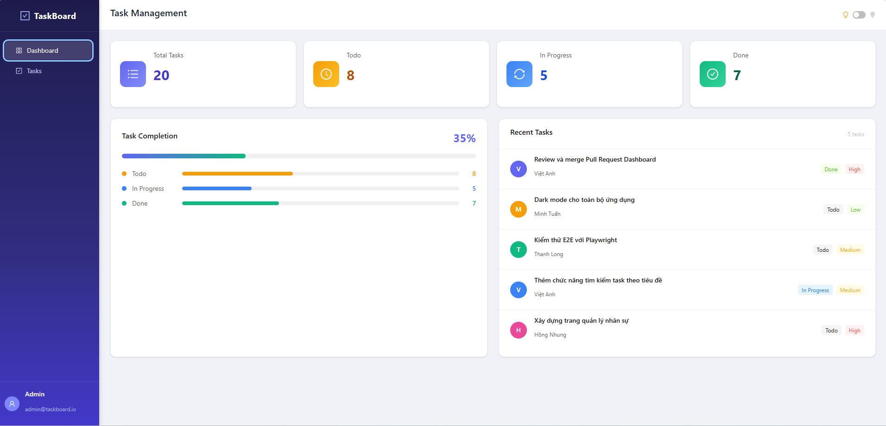
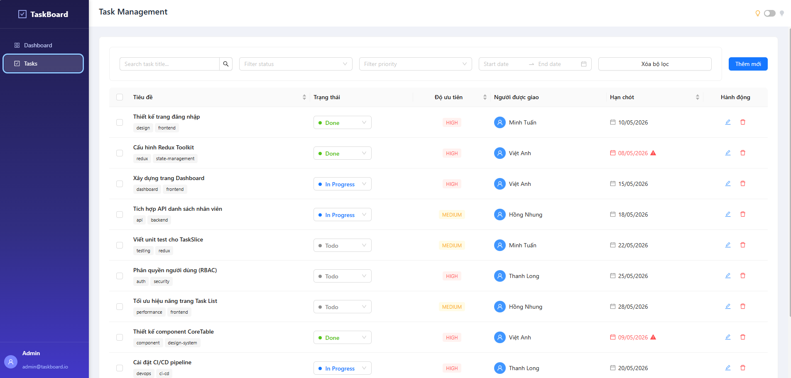
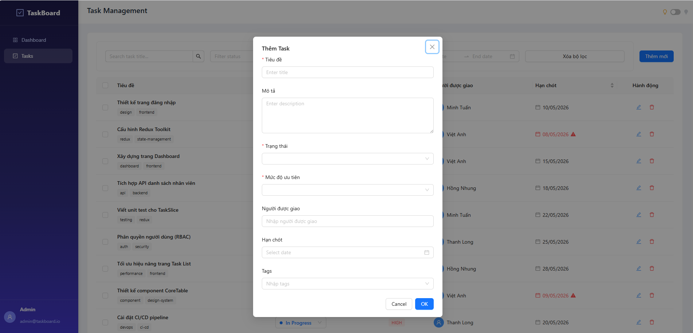
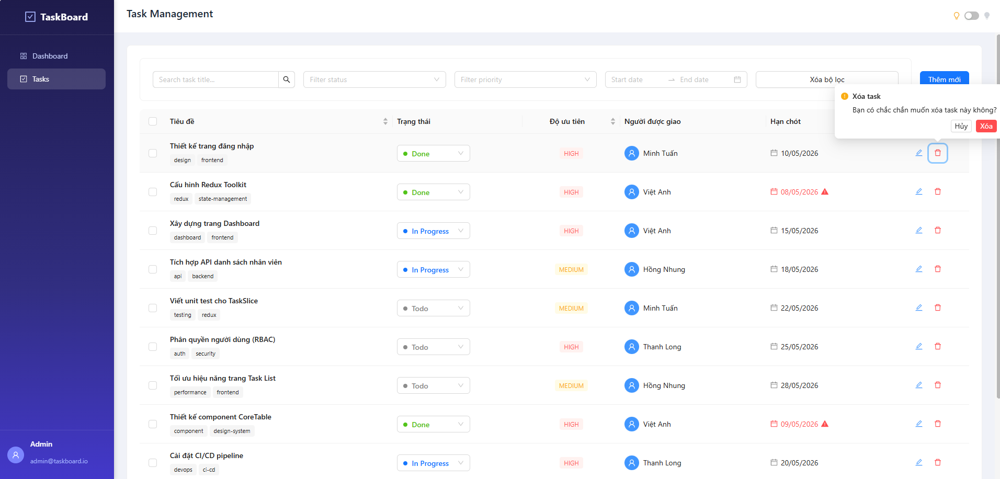
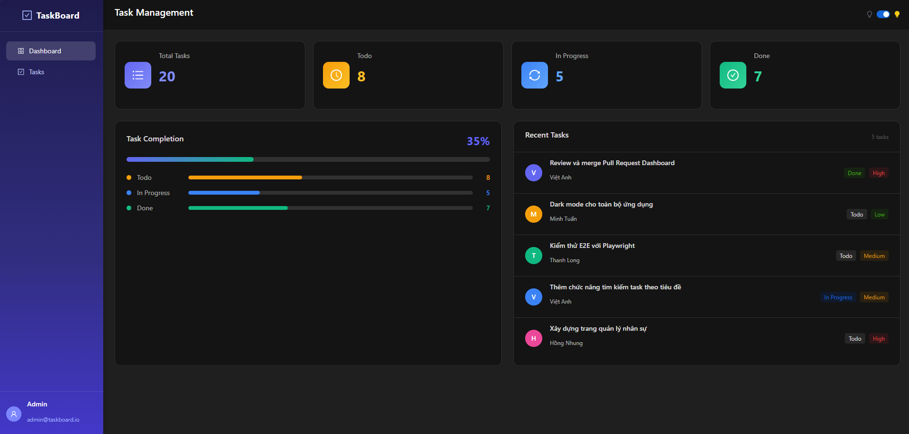
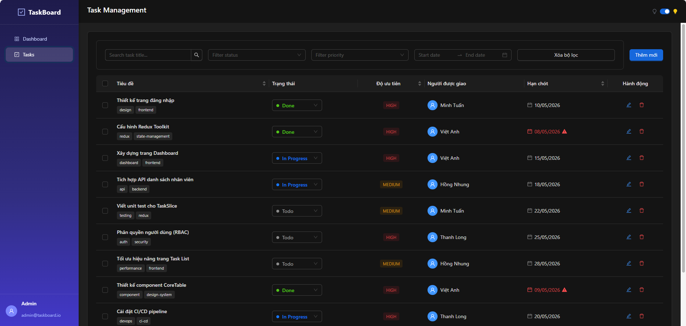

# Task Management App — Test-FE-Nguyễn Việt Anh

Ứng dụng quản lý công việc (Task Management) xây dựng bằng React + TypeScript, bao gồm Dashboard tổng quan và trang quản lý task với đầy đủ chức năng CRUD.

## Tech Stack

| Thư viện         | Phiên bản | Mục đích              |
| ---------------- | --------- | --------------------- |
| React            | 19        | UI framework          |
| TypeScript       | 6         | Type safety           |
| Vite             | 8         | Build tool            |
| Ant Design       | 6         | UI component library  |
| Tailwind CSS     | 4         | Utility-first styling |
| Redux Toolkit    | 2         | State management      |
| React Router DOM | 7         | Client-side routing   |
| Day.js           | 1.11      | Xử lý ngày tháng      |
| Vitest           | 4         | Unit testing          |

## Tính năng

### Dashboard (`/`)

- **Stats Cards** — hiển thị tổng số task, phân loại theo trạng thái (Todo / In Progress / Done)
- **Task Progress** — biểu đồ tiến độ theo trạng thái
- **Recent Tasks** — danh sách các task mới nhất

### Quản lý Task (`/tasks`)

- Xem danh sách task dạng bảng với phân trang
- **Thêm mới** task qua modal form
- **Chỉnh sửa** thông tin task
- **Xóa** từng task hoặc **xóa hàng loạt** (bulk delete)
- **Lọc** theo: từ khóa tìm kiếm, trạng thái, mức độ ưu tiên, khoảng thời gian
- **Cập nhật trạng thái** task trực tiếp trên bảng (inline select)
- Reset bộ lọc về mặc định

### Khác

- Hỗ trợ **Dark / Light mode**
- Dữ liệu mock sẵn để demo

## Cấu trúc thư mục

```
src/
├── components/
│   ├── dashboard/          # StatsCards, TaskProgress, RecentTasks
│   ├── layout/             # MainLayout (sidebar + header)
│   └── task/
│       ├── filters/        # TaskFilters, SearchFilter, StatusFilter, PriorityFilter, DateRangeFilter
│       ├── tags/           # TaskStatusTag, TaskPriorityTag
│       ├── TaskTable.tsx
│       ├── TaskModal.tsx
│       ├── TaskForm.tsx
│       ├── TaskActions.tsx
│       └── TaskStatusSelect.tsx
├── features/
│   ├── tasks/              # Redux slice, selectors, mock data
│   └── theme/              # Redux slice dark/light mode
├── pages/
│   ├── Dashboard/
│   └── Tasks/
├── hooks/                  # useAppDispatch, useAppSelector
├── routes/                 # React Router config
├── store/                  # Redux store
└── types/                  # TypeScript types
```

## Cài đặt & Chạy

Sau khi clone thành công chương trình:
B1: Mở Terminal, chuyển sang nhánh develop-new
B2: Thực hiện các lệnh

```bash
# Cài dependencies
npm install

# Chạy development server
npm run dev

# Build production
npm run build

# Chạy tests
npm test

# Preview build
npm run preview
```

B3: Ứng dụng chạy tại: `http://localhost:5173`
-Screenshot Dashboard:

-Screenshot CRUD Task:




-Screenshot DarkMode:



## State Management

Redux Toolkit quản lý toàn bộ state qua hai slice:

- **`tasks`** — danh sách task, bộ lọc, phân trang
- **`theme`** — dark/light mode

Selectors tách riêng trong `features/tasks/selectors.ts` để xử lý logic lọc và phân trang.

## Testing

```bash
npm test
```

Sử dụng **Vitest** + **@testing-library/react**. Test files đặt cạnh component với suffix `.test.tsx`.
